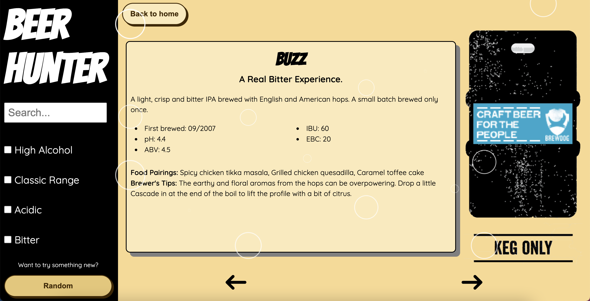

# BEER HUNTER

Welcome to Beer Hunter. Sift through over 300 beers across 5 pages to find your match made in heaven. All beers are sourced from an external API called [Punk-API](https://punkapi.com/).

```js
const getBeers = async () => {
  const url = `https://api.punkapi.com/v2/beers/?&page=${page}&per_page=80&`;

  let urlWithParams = url;

  if (search !== "") {
    urlWithParams += `beer_name=${search}&`;
  }

  if (abv) {
    urlWithParams += `abv_gt=6&`;
  }

  if (range) {
    urlWithParams += `brewed_before=01-2010&`;
  }

  if (bitter) {
    urlWithParams += `ibu_gt=45&`;
  }

  const res = await fetch(urlWithParams);
  const data = await res.json();
  setApiBeers(data);
};
```

If that sounds a little overwhelming, there are 5 filter functions to choose from to narrow your search :

- Already know what you're looking for? Type it straight into the search bar
- Big night ahead? Try a beer with a High Alcohol Content (ABV > 6%)
- Creature of habit? Check out the beers in the Classic Range (Brewed before 2010)
- Fancy an added zing? Look through the acidic beers (pH < 4)
- Like your beer to resemble a lemon? Try the Bitter filter (IBU > 45)

These filters were achieved by incorporating `useEffect()` and `useState()` into the code:

```js
const [search, setSearch] = useState < string > "";
const [abv, setABV] = useState < boolean > false;
const [range, setRange] = useState < boolean > false;
const [acidic, setAcidic] = useState < boolean > false;
const [bitter, setBitter] = useState < boolean > false;

useEffect(() => {
  getBeers();
}, [search, abv, range, acidic, bitter]);
```

## Website Screenshots



